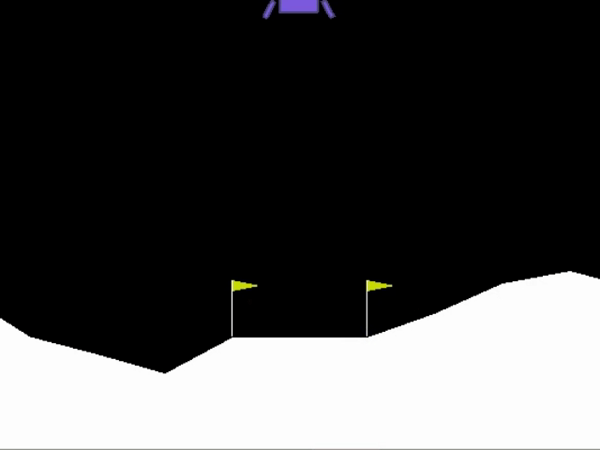

# lunarlander_genetic
This was inspired by the [Deep Neuroevolution paper](https://arxiv.org/abs/1712.06567) by Such et. al. It was a project for my CS 674 Advanced Deep Learning course at BYU in which I wanted to dive further into deep reinforcement learning.

As a robotics engineer, I have come across many optimization problems and the methods used to solve them. I had a basic understanding of how a genetic algorithm works from coding up a simple optimization problem in a previous class, but the problem was simple, so I didn't feel like I had a real sense for using GAs yet. So I thought that implementing a genetic algorithm for training a neural network in reinforcement learning would be a great way to understand both concepts more intimately. For some reason, I felt that the learning curve wasn't steep enough yet, which birthed the impulse to code it in Rust. I am a huge fan and proponent of Rust, but it isn't exactly known for its machine learning libraries like Python! In the end, the odds were ever in my favor, and I found [`tch-rs`](https://github.com/LaurentMazare/tch-rs) - an incredibly well-polished Rust library providing bindings to the C++ API of PyTorch by [LaurentMazare](https://github.com/LaurentMazare). With that, my Rust impulse went from a "maybe some day" goal to a "LET'S DO THIS!!" goal.

I chose to use the [LunarLanderContinuous-v2](https://gym.openai.com/envs/LunarLanderContinuous-v2) environment from [OpenAI Gym](https://github.com/openai/gym) as my reinforcement learning arena. In this 2D task, you have a rocket-powered lander with a main (downward) engine and left and right engines. The goal is to land the vehicle as gently as possible onto a landing target. The observation space is a vector of size 8 containing 2D position, 2D velocity, angle, angular velocity, and contact of the left and right legs with the ground. The action space is two real continuous values between -1.0 to 1.0. The first value is the main engine throttle from 0% (-1.0) to 100% (1.0), and the second value is the left-right throttle from 100% left engine (-1.0) to 100% right engine (1.0). But, to produce any thrust at all, an engine must be at 50% throttle or greater -- analogous to a real liquid rocket engine -- i.e., for the first number, values from -1.0 to 0.0 do not produce any thrust, and likewise values from -0.5 to 0.5 for the second number. This added realism, along with the values being continuous, make this task much more difficult than its discrete-valued sibling [LunarLander-v2](https://gym.openai.com/envs/LunarLander-v2). Fortunately, a genetic algorithm has no issue producing continuous outputs (as opposed to a Deep Q-network algorithm, which usually only works with discrete outputs). This task seemed simple enough to be learnable in a modest time frame, yet challenging enough to give the genetic algorithm a good test of strength.

## Network Design

My research into deep RL with a genetic algorithm led me to a paper done by Uber AI Labs (Such et al., 2018) where they did exactly that, only on a larger scale. Their experiments were spread over three domains, of which I will only mention one: learning to play Atari. I began by basing my design on their deep Q-network (DQN) architecture, which in turn is identical to the network architecture that Google DeepMind used to learn to play Atari in their seminal paper (Mnih et al., 2015). It soon dawned on me that the while the outputs of my network and the DeepMind DQN were similar, the inputs were completely different!

The DeepMind DQN was trained on pure pixel data, while for my task, the input was the agent's state (the observation space I described above). Training a convolutional neural network with a one-dimensional state vector does not make any sense, as the input looks nothing like an image. I then switched to an MLP network consisting of two hidden layers of 32 units, each followed by a ReLU activation. This brought the number of trainable parameters in the network from over 4 million down to a manageable 1,410.

The network parameters were initialized using PyTorch's default uniformly random initialization. Once I had begun training, I noticed that some initializations resulted in much poorer performance throughout training. These bad initializations were clearly indicated by the scores received during the first few episodes. If I saw average scores below -150 for the first few episodes, I was able to avoid this problem by discarding the network and initializing a new one, repeating if necessary until average scores started out above -150. This turned out to be a very effective strategy for avoiding bad initializations of weights (and took less time than coming up with a programmatic solution, too).

## Training
### Genetic Algorithm

I based the genetic algorithm off of the simple Deep GA explained in the paper by Uber AI Labs. The algorithm is population-based, in which a "population" of individuals are evaluated for their "fitness" and only the fittest ones survive to go on and "reproduce" In my implementation, the population size was set to 100. Each individual is a full solution of 1,410 network parameters, stored as one row in a 100 by 1,410 size matrix (100 individuals of 1,410 parameters each). One epoch consists of evaluating all 100 individuals for their fitness score, then selecting the top 10 fittest individuals and discarding the rest. From these 10 sets of network weights, a random number of clones of each individual is created, amounting to a new generation of 100 clones. The elite -- the fittest individual -- remains an exact clone, while the other 99 individuals are mutated by applying additive Gaussian noise to all their weights. The random noise $\epsilon \sim \mathcal{N}(0,I)$ was multiplied by a mutation factor $\sigma$ which was at first set to 0.002. Once the network's performance began to significantly improve, I lowered this number to 0.001 to keep offspring from mutating too far away from their high-performing parents.

For the very first generation, the network was initialized according to the process outlined above, and the initialized weights were then used as the starting point of all individuals. After that, the population was mutated as usual.

### Evaluation

Each epoch, the entire population is evaluated by looping through each individual and replacing the weights of the network with the individual. An individual is a flattened array the length of all the network's weights and biases, so careful indexing along the array was required to fill each weight matrix and bias vector of the network with the appropriate number of values. The network is then used to map observations to actions through each step of an episode until it is finished. The total reward from the episode is saved onto an array of rewards for that individual. The individual is evaluated over 10 episodes, resulting in 10 scores per individual. The next individual is then evaluated by replacing the network's weights with its own, and so on.

Fitness was calculated in two ways. When I began, I chose fitness to be an individual's mean score over 10 episodes, and this seemed to be an effective strategy for a time. OpenAI's website defines an agent "solving" the task to be scoring an average of 200 points over 100 consecutive episodes. Thus, I chose to evaluate based on the mean score. Over time, however, I decided to change the metric to mean the individuals with the highest *minimum* score over all 10 episodes. The reason for this is explained in the next section.

## Results

The results were surprisingly good. Average scores for the elite individual had a very slow climb starting from around -130 up to about -40 (nearly 1800 epochs/generations), and then, within about 100 generations, the average scores jumped up to nearly 100. I then continued training for another 1000 generations, and the average scores were close to 200. However, at this point I decided to look at all 10 scores for each individual, and I found that even though the average score of the top individual was close to 200, there were always at least one episode with scores below zero. I found this troubling; if I were designing a real lunar lander, I would not design it to achieve an *average* score of 200 over 100 consecutive episodes -- I would design it to achieve a *minimum* score of at least 200 over 100 consecutive episodes! Crashing a lunar lander is extremely bad, so I decided to alter my approach. I started by loading the weights I had trained so far, but instead of training using the highest mean score as the measure of fitness, I used the highest minimum score. After making the change, the highest minimum scores were consistently around -20 to -30. I left the algorithm to train for another 2000 epochs, and the highest minimum scores climbed to be consistently over 40, occasionally even reaching above 200! While this would not meet the definition of a minimum of 200 over 100 consecutive episodes, I can say that it is capable of reaching that over 10 episodes, which I find to be very impressive. The mean scores of the elites also improved to be above 200 almost 50% of the time, and almost always above 150.

## Conclusion

This was a very simple genetic algorithm, yet it seems to have performed quite well on a moderately difficult task with a challenging reward space and a continuous action space. Training times were much longer than I had hoped, and time constraints prevented me from parallelizing the evaluation of each of the 10 episodes for an individual, which was the primary bottleneck. Given this, and the results from the Deep Nueroevolution paper, I believe the genetic algorithm has proved that it is worth talking about in the field of reinforcement learning.